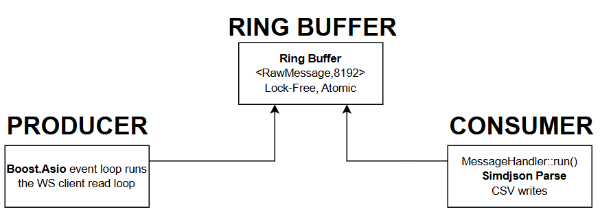

# Binance WebSocket Market Data Capture + Local Order Book

A C++17 application that connects to Binance public WebSocket streams, captures real-time market data into CSV files, and maintains a local Limit Order Book (LOB) with top-of-book snapshots generated after each processed event.

The application subscribes to Binance combined streams for the configured symbols and records every incoming message with a nanosecond-resolution receive timestamp. Each message is written to a market data CSV file along with the original Binance payload for auditing and replay purposes.

A separate consumer thread processes the incoming messages using simdjson, updates the local order book based on depth updates, and writes top-5 bid/ask snapshots to an order book CSV file. Price and quantity values are stored as fixed-point integers using a scale factor of `10^8` to avoid floating-point precision issues and ensure deterministic output.

To prevent network operations from being blocked by parsing or file I/O, the application uses a lock-free single-producer single-consumer (SPSC) ring buffer between the WebSocket thread and the processing thread. This keeps message ingestion and order book updates independent while maintaining event ordering.

---
## Table of Contents

- [Build Environment](#build-environment)
- [Dependencies](#dependencies)
- [Build Instructions](#build-instructions)
- [Run Instructions](#run-instructions)
- [Venues and Symbols](#venues-and-symbols)
- [Output Files](#output-files)
- [Market Data CSV Schema ](#market-data-csv-schema)
- [Order Book CSV Schema (Deliverable B)](#order-book-csv-schema)
- [Price and Quantity Scaling](#price-and-quantity-scaling)
- [Event Type Mapping](#event-type-mapping)
- [Side Mapping](#side-mapping)
- [Reconnection Handling](#reconnection-handling)
- [Sequence and Gap Handling](#sequence-and-gap-handling)
- [CSV Compliance](#csv-compliance)
- [Instrument ID Derivation](#instrument-id-derivation)
- [Metrics and Counters](#metrics-and-counters)
- [Limitations](#limitations)
- [Sample Run](#sample-run)
- [Sample Output](#sample-output)
- [Build Flags](#build-flags)
---

## Build Environment

| Item | Value |
|------|-------|
| Compiler | GCC 12 (`g++-12`) |
| C++ Standard | C++17 (`CMAKE_CXX_STANDARD 17`) |
| Build System | CMake 3.16+ with Make or Ninja |
| Build Type | Release (recommended) or Debug |

---

## Dependencies

| Library | Version | Purpose | How Obtained |
|---------|---------|---------|-------------|
| Boost | 1.74+ | Boost.Asio (async I/O), Boost.Beast (WebSocket/HTTP) | System package (`libboost-all-dev`) |
| OpenSSL | 3.0+ | TLS encryption for `wss://` connections | System package (`libssl-dev`) |
| simdjson | 3.x | High-performance SIMD-accelerated JSON parsing | Auto-downloaded via CMake FetchContent |
| pthreads | System | POSIX threads | System (linked via `-lpthread`) |
| zlib | System | Compression support for Boost | System package (`zlib1g-dev`) |

Install on Ubuntu 22.04:

```bash
sudo apt-get update
sudo apt-get install -y cmake ninja-build g++-12 libssl-dev libboost-all-dev zlib1g-dev
```
---

## Build Instructions

```bash
git clone https://github.com/nishrajpal05/binance-lob-capture.git
cd binance-lob-capture

cmake -B build -G Ninja \
  -DCMAKE_BUILD_TYPE=Release \
  -DCMAKE_CXX_COMPILER=g++-12 \
  -DCMAKE_CXX_FLAGS="-Wall -Wextra -O2"

cmake --build build --parallel
```
---

## Run Instructions

### Live Capture

```bash
./build/binance_capture \
  --venue <spot|usdm> \
  --symbols <SYMBOL1,SYMBOL2,...> \
  --output-dir <directory> \
  [--duration <seconds>]
```

### Examples

```bash
# Spot, single symbol, 60 seconds
./build/binance_capture --venue spot --symbols BTCUSDT --duration 60 --output-dir ./output

# Spot, multiple symbols, run until Ctrl+C
./build/binance_capture --venue spot --symbols BTCUSDT,ETHUSDT --output-dir ./output

# USD-M Futures, single symbol, 120 seconds
./build/binance_capture --venue usdm --symbols BTCUSDT --duration 120 --output-dir ./output
```

### Stopping

- Press `Ctrl+C` (sends SIGINT) for graceful shutdown
- Or use `--duration N` for automatic stop after N seconds
- On shutdown: flushes all CSV buffers, joins threads, prints metrics to stderr

### Replay Mode (Offline)

```bash
./build/binance_capture \
  --replay <path-to-market-data-csv> \
  --output-dir <output-directory>
```

---

## Venues and Symbols

### Supported Venues

| Venue Flag | Binance Product | WebSocket Endpoint |
|-----------|----------------|-------------------|
| `spot` | Spot market | `wss://stream.binance.com:9443/stream?streams=` |
| `usdm` | USD-M Futures | `wss://fstream.binance.com/public/stream?streams=` |

The USD-M endpoint uses the `/public` path as required by Binance derivatives documentation for accessing `@trade` streams.

### Symbol Input Format

- Provide symbols as a comma-separated uppercase list: `BTCUSDT,ETHUSDT,SOLUSDT`
- No spaces between symbols
- Symbols are converted to lowercase internally for URL construction per Binance API requirements
- Output CSV records the symbol in uppercase

### Subscribed Streams Per Symbol

For each symbol, three combined streams are subscribed:

| Stream | Role |
|--------|------|
| `<symbol>@depth@100ms` | Differential depth updates (`depthUpdate`) |
| `<symbol>@depth5@100ms` | Partial top-of-book snapshot (5 levels, sanity refresh) |
| `<symbol>@trade` | Individual trade events |

---

## Output Files

### File Naming

```
<output-dir>/market_data_<venue>_<SYMBOL>_<UTC-date>.csv
<output-dir>/market_data_<venue>_<SYMBOL>_<UTC-date>_orderbook.csv
```

Examples:
```
output/market_data_spot_BTCUSDT_2026-06-06.csv
output/market_data_spot_BTCUSDT_2026-06-06_orderbook.csv
```
---

## Market Data CSV Schema 

### Header (exact, fixed order)

```
recv_tsec,recv_tnsec,venue,stream_kind,shard_id,conn_epoch,conn_seq,symbol,payload_json
```

### Column Definitions

| Column | Type | Description |
|--------|------|-------------|
| `recv_tsec` | int64 | Seconds part of receive wall-clock time (see Timestamp Policy) |
| `recv_tnsec` | int32 | Nanosecond remainder within the second, range [0, 999999999] |
| `venue` | string | `spot` or `usdm` |
| `stream_kind` | string | `depth_diff`, `depth5`, or `trade` |
| `shard_id` | int | Shard index, always `0` for single-connection mode |
| `conn_epoch` | int | Connection epoch counter (see Connection Epoch) |
| `conn_seq` | uint64 | Monotonically increasing within (shard_id, conn_epoch) |
| `symbol` | string | Uppercase symbol, e.g. `BTCUSDT` |
| `payload_json` | string | The inner Binance `data` object as minified JSON, CSV-escaped per RFC 4180 |


---
## Order Book CSV Schema

One row per processed event. Each row is a snapshot of the top-5 bid and ask levels after the event is applied to the local order book.

### Header (exact, 26 data columns)

```
tsec,tnsec,seqNo,id,type,side,bid0,bid1,bid2,bid3,bid4,bid_size0,bid_size1,bid_size2,bid_size3,bid_size4,ask0,ask1,ask2,ask3,ask4,ask_size0,ask_size1,ask_size2,ask_size3,ask_size4
```

### Column Definitions

| Column | Type | Description |
|--------|------|-------------|
| `tsec` | int64 | Seconds part of receive timestamp |
| `tnsec` | int32 | Nanosecond remainder |
| `seqNo` | uint64 | Monotonically increasing application sequence number (1-based) |
| `id` | int32 | Stable numeric instrument ID (see Instrument ID Derivation) |
| `type` | char | Event type: `D` (depth diff), `F` (depth5 full), `T` (trade) |
| `side` | char | `B` (buy), `S` (sell), `N` (neutral / not applicable) |
| `bid0`-`bid4` | int64 | Top 5 bid prices as integer ticks (see Price Scaling) |
| `bid_size0`-`bid_size4` | int64 | Top 5 bid quantities as integer ticks (see Quantity Scaling) |
| `ask0`-`ask4` | int64 | Top 5 ask prices as integer ticks |
| `ask_size0`-`ask_size4` | int64 | Top 5 ask quantities as integer ticks |

---

## Price and Quantity Scaling

### Price Scale

All prices are stored as **64-bit integers** with a fixed scale factor of **10^8** (100,000,000).

```
Decimal string "65432.12300000"
→ integer_part = 65432
→ fractional_part = 12300000 (padded to 8 digits)
→ stored value = 65432 × 100000000 + 12300000 = 6543212300000
```

To recover the human-readable price: `stored_value / 100000000.0`

### Quantity Scale

All quantities use the same **10^8** scale factor.

```
"0.00019000" → 19000
"1.50000000" → 150000000
```

### Why Fixed-Point (No Floating Point)

All parsing and arithmetic is performed using pure integer operations. No `float` or `double` is used in the data path. This guarantees:

- **Determinism**: identical input always produces identical output on any platform
- **No rounding errors**: `0.1 + 0.2 == 0.3` (exact in integer math)
- **Auditability**: replaying the same market data CSV produces byte-identical order book output

The parser (`fp::parse_decimal`) manually walks the string character by character, separating integer and fractional parts, padding the fraction to 8 digits, and combining via multiplication and addition. Zero use of `strtod`, `atof`, or any floating-point function.

---

## Event Type Mapping

| `type` Value | Stream Source | Meaning |
|-------------|--------------|---------|
| `D` | `<symbol>@depth@100ms` | Differential depth update (`depthUpdate`). Applied as incremental changes to the internal order book maps. |
| `F` | `<symbol>@depth5@100ms` | Full top-5 snapshot. Replaces the top-5 display directly (replace semantics). |
| `T` | `<symbol>@trade` | Individual trade. Does NOT modify the order book. Emits a snapshot with the current book state. |

---

## Side Mapping

| `side` Value | Meaning | How Determined |
|-------------|---------|----------------|
| `B` | Buy (taker is buyer) | Trade event with `m: false` (buyer is NOT maker, so buyer is taker) |
| `S` | Sell (taker is seller) | Trade event with `m: true` (buyer IS maker, so seller is taker) |
| `N` | Neutral / not applicable | All depth_diff and depth5 events (no trade direction) |

---
## Threading Design

<p align="center">
  
</p>
<p align="center">
  <b>Figure. </b> Producer-Consumer architecture using a lock-free ring buffer.
</p>

- **Producer**: Runs `boost::asio::io_context::run()`. The WebSocket client reads messages, stamps wall-clock time, extracts stream metadata, copies the payload into a pre-allocated ring buffer slot, and commits the push. No JSON parsing, no file I/O.

- **Ring Buffer**: `SPSCRingBuffer<RawMessage, 8192>` — a single-producer single-consumer lock-free circular buffer. Capacity is 8192 (power of 2 for branchless modulo via bitmask). Uses `std::atomic` head/tail with `memory_order_acquire`/`release` for synchronization. Head and tail are aligned to 64-byte cache lines (`alignas(64)`) to prevent false sharing.

- **Consumer**: Runs `MessageHandler::run()`. Pops messages from the ring buffer, parses JSON with simdjson, updates the order book, and writes both CSV files. When the buffer is empty, yields CPU briefly (100 iterations), then sleeps 100 microseconds to balance responsiveness with efficiency.

### Why This Design

- The network thread is never blocked by disk I/O
- The consumer thread is never blocked by network latency
- The ring buffer absorbs temporary speed mismatches (up to 8192 messages of backlog)
- No mutex is ever acquired in the hot path
---

## Reconnect and Gap Handling

The application automatically reconnects whenever the WebSocket connection is lost due to a network issue, server disconnect, or read error.

### Reconnect Strategy

When a disconnect occurs:

1. The current WebSocket connection is closed.
2. A reconnect timer starts using exponential backoff:
   - 1 second
   - 2 seconds
   - 4 seconds
   - 8 seconds
   - 16 seconds
   - Maximum 30 seconds

After a successful reconnect:

- `conn_epoch` is incremented to indicate a new connection session.
- `conn_seq` is reset to `0`.
- The reconnect delay is reset back to 1 second.
- `g_metrics.reconnects` is incremented.
- A status message is printed to `stderr`:

```text
[ws] connected to <host> epoch=<N>
```

### Order Book Behaviour After Reconnect

The local order book is **not reset** when a reconnect occurs.

I chose this approach to keep the implementation simple and avoid rebuilding the entire book after every temporary network interruption. Since Binance provides `depth5` snapshots every 100 ms, the visible top-of-book levels are refreshed very quickly after reconnection. Incoming `depthUpdate` messages then continue updating the internal bid and ask maps.

As a result, the book may contain slightly stale state immediately after reconnecting, but it converges quickly as new market data arrives.

### Sequence Gap Detection

For differential depth updates, the application tracks Binance sequence fields (`U`, `u`, and `pu`).

If a discontinuity is detected, the event is recorded as a sequence gap and counted in the application metrics. This helps identify situations where messages may have been missed due to a reconnect or temporary network issue.

The current implementation continues processing incoming updates while recording gap information for monitoring and debugging purposes.

---

### Binance Sequence IDs (depth diffs only)

Each `depthUpdate` message contains:

| Field | Meaning |
|-------|---------|
| `U` | First update ID in this event |
| `u` | Final update ID in this event |
| `pu` | Previous event's final update ID (USD-M only; -1 if absent on Spot) |

### Gap Detection Logic

```
if last_final_update_id < 0:
    result = FirstUpdate          (first diff ever received)
elif pu >= 0 AND pu != last_final_update_id:
    result = SequenceGap          (missed one or more messages)
else:
    result = Ok                   (continuous sequence)

last_final_update_id = u          (always update regardless of gap)
```

When a `SequenceGap` is detected:
- `g_metrics.sequence_gaps` is incremented
- The diff is still applied (best-effort continuation)
- The book will self-correct via subsequent diffs and depth5 refreshes

### Note on Spot vs USD-M

Spot depth streams do not include the `pu` field. In this case, `pu` defaults to `-1` and the gap check is skipped (the `pu >= 0` guard). USD-M streams include `pu` and full gap checking is active.

---

## CSV Compliance

### RFC 4180

Both CSV files comply with RFC 4180:

- Delimiter: comma (`,`)
- Encoding: UTF-8
- Line endings: `\n` (written in binary mode `"wb"`)
- First row is the header with exact column names
- Fields containing commas, double quotes, or newlines are enclosed in double quotes
- Internal double quotes are escaped as `""` (two consecutive double-quote characters)

The `payload_json` field always contains commas (JSON), so it is always wrapped in double quotes with internal `"` escaped as `""`.

Example:
```
...,BTCUSDT,"{""e"":""trade"",""s"":""BTCUSDT"",""p"":""65432.10""}"
```

---

## Instrument ID Derivation

Each unique symbol is assigned a stable numeric ID on first encounter:
```
First symbol seen  → id = 0
Second symbol seen → id = 1
Third symbol seen  → id = 2
...
```
---

## Metrics and Counters

On shutdown, the following metrics are printed to stderr:

| Metric | Description |
|--------|-------------|
| `messages_received` | Total messages pushed into the ring buffer by the network thread |
| `messages_processed` | Total messages popped and processed by the consumer thread |
| `parse_errors` | Messages where JSON parsing failed (simdjson error) |
| `sequence_gaps` | Depth diffs where `pu != last_final_update_id` |
| `reconnects` | Number of WebSocket connections established |
| `md_rows_written` | Rows written to the market data CSV |
| `ob_rows_written` | Rows written to the order book CSV |
| `ring_full_count` | Messages dropped because the ring buffer was full |

All counters are `std::atomic<uint64_t>` with `memory_order_relaxed` for minimal overhead. They are safe to read/write from multiple threads without locks.

---


## Limitations

1. **No REST depth snapshot synchronization**: The optional stretch goal of fetching a full depth snapshot via REST API and buffering diffs until sync is not implemented. The order book builds incrementally from the first received diff, so early snapshots may be incomplete until enough diffs accumulate.
2. **Single shard**: All symbols share one WebSocket connection. High symbol counts (10+) may approach Binance's per-connection message rate limits.
3. **No cross-venue deduplication**: If the same symbol is subscribed on both spot and usdm, they are treated as independent instruments.
4. **No compression**: WebSocket permessage-deflate is not enabled. All messages are received uncompressed.
5. **Ring buffer size is fixed at compile time**: 8192 slots. Not configurable at runtime.

---

## Sample Run

### Command

```bash
./build/binance_capture --venue spot --symbols BTCUSDT --duration 30 --output-dir ./output
```

### Expected Output (stderr)

```
Starting capture: venue=spot symbols=BTCUSDT output=./output
[ws] connected to stream.binance.com epoch=0

--- Capture Metrics ---
Messages received:    ~900
Messages processed:   ~900
Parse errors:         0
Sequence gaps:        0
Reconnects:           1
Market data rows:     ~900
Order book rows:      ~900
Ring buffer overflows: 0
---
```

---

## Sample Output

### Market Data CSV (first 2 rows)

```csv
recv_tsec,recv_tnsec,venue,stream_kind,shard_id,conn_epoch,conn_seq,symbol,payload_json
1780594920,301652851,spot,trade,0,0,0,BTCUSDT,"{""e"":""trade"",""E"":1780594920374,""s"":""BTCUSDT"",""t"":6361902066,""p"":""63031.83000000"",""q"":""0.00019000"",""T"":1780594920374,""m"":true,""M"":true}"
```

### Order Book CSV (sample row after depth data arrives)

```csv
tsec,tnsec,seqNo,id,type,side,bid0,bid1,bid2,bid3,bid4,bid_size0,bid_size1,bid_size2,bid_size3,bid_size4,ask0,ask1,ask2,ask3,ask4,ask_size0,ask_size1,ask_size2,ask_size3,ask_size4
1780594920,440638984,4,0,F,N,6303183000000,6303182000000,6303087000000,6303069000000,6303068000000,147180000,18000,8000,18000,4070000,6303184000000,6303185000000,6303186000000,6303256000000,6303257000000,234093000,88000,16000,18000,1596000
```

Reading the above: `bid0 = 6303183000000 / 10^8 = $63031.83`, `ask0 = 6303184000000 / 10^8 = $63031.84`, spread = $0.01.

---


## Build Flags

The following compiler flags are enabled in `CMakeLists.txt`:

```cmake
target_compile_options(binance_capture PRIVATE -Wall -Wextra)
```

| Flag | Purpose |
|------|---------|
| `-Wall` | Enable all standard compiler warnings |
| `-Wextra` | Enable additional warnings beyond `-Wall` |
| `-O2` / `-O3` | Optimization (set by `CMAKE_BUILD_TYPE=Release`) |

### Compiler Warnings

The project may produce a few GCC `-Wunused-result` warnings for simdjson `.get()` calls.

These warnings occur because simdjson marks `.get()` with `warn_unused_result`, and GCC does not suppress the warning even when the return value is explicitly cast to `(void)`.

The warnings are harmless in this project because JSON parsing errors are checked before field access, and all destination variables are initialized with safe default values.

Compiler warnings remain enabled (`-Wall -Wextra`) to help catch genuine issues during development.
---
